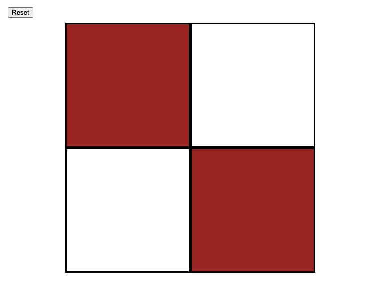

# Etch_a_sketch

This project was created to work on my DOM manipulation skills.

    

## Features

- Utilizes a resizeable grid.
- Allows the user to reset it without refreshing the page.
- Once reset, the grid can be resized between 1 and 100 squares squared.

## Installation

1. Clone the repo onto your computer.
2. Open the index.html file within a browser.

## Demo

- https://cameronstamant.github.io/Etch_a_sketch/
